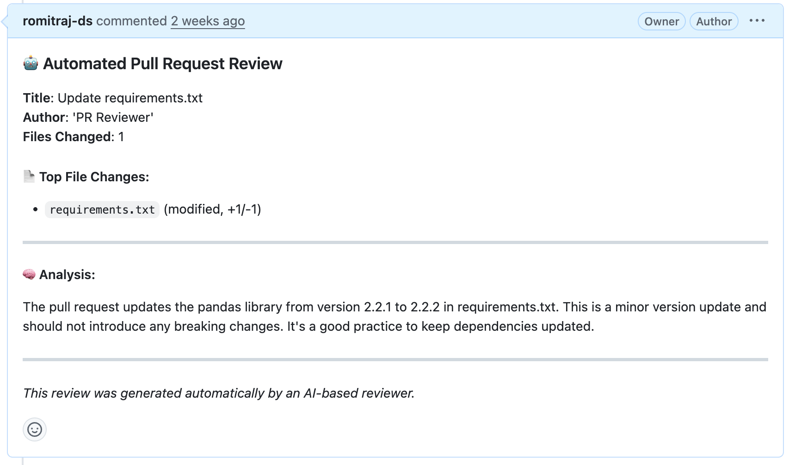

# 🤖 PR Reviewer Agent

## 📋 Introduction
PR Reviewer is an AI-powered Agent that automatically analyzes and reviews GitHub Pull Requests.
It leverages LLM to provide insightful feedback on code changes, helping teams
maintain code quality and accelerate the review process.

## ✨ Features
- **Automated Code Reviews**: AI-driven analysis of GitHub Pull Requests
- **GitHub Integration**: Posts review comments directly to your Pull Requests
- **Natural Language Interface**: Simple question-based interaction through CLI or API
- **Containerized Deployment**: Easy setup and consistent environment using Docker


## ⚙️ Functionality
The PR Reviewer works by:
1. Accepting a GitHub Pull Request URL as input
2. Fetching and analyzing the code changes using AI models
3. Generating comprehensive review comments with suggestions and best practices
4. Posting the review directly to the GitHub PR
5. Providing the same review in the response for local reference

## 🛠️ Technology Stack

### 🏗️ Core Frameworks
- **FastAPI**: High-performance web framework for building APIs
- **Uvicorn**: ASGI server for running the FastAPI application
- **Docker**: For containerization and deployment

### 🧠 AI & Language Processing
- **MCP (Model Context Protocol)**: Framework for orchestrating AI workflows through standardized communication
- **LangChain**: Composition framework for LLM applications
  - langchain_mcp_adapters: Adapters for MCP integration
  - langchain-google-genai: Google AI model integrations
- **LangGraph**: Flow control for complex LLM reasoning chains
- **Google Generative AI**: Provides the underlying AI models (Gemini)


## 🔧 Environment Setup
Update the env variables with real keys


## 🐳 Duild a docker image
```bash
docker build -t pr-reviewer:0.0.1 .
```

## 🚀 Run the docker as service
```bash
docker run --rm -p 8000:8000 pr-reviewer:0.0.1
```

## 📡 Ask service to review PR
```bash
curl -X POST http://localhost:8000/review \
  -H "Content-Type: application/json" \
  -d '{"question": "Analyse and comment on PR: https://github.com/<owner>/<repo>/pull/<number>"}'
```

## 💬 Response
- The AI will return a review comment in the terminal.
- The same comment will also be posted directly on the GitHub Pull Request as a comment.


